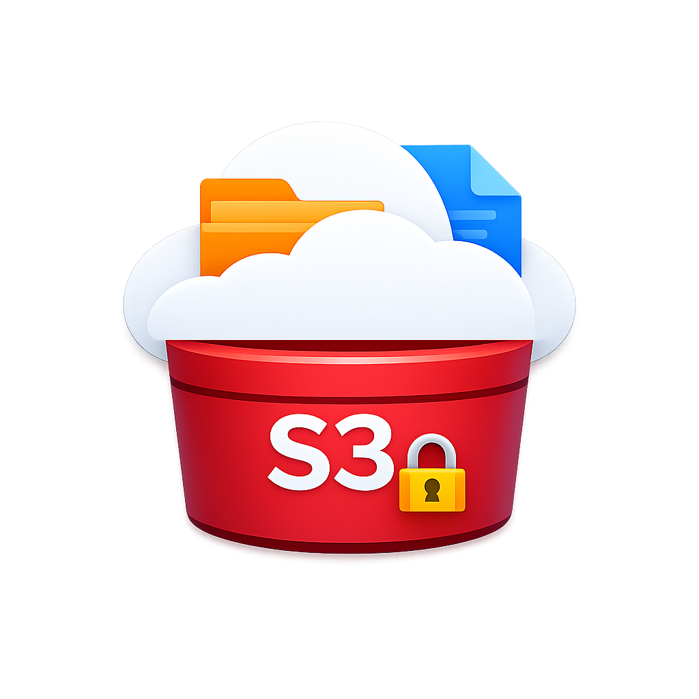
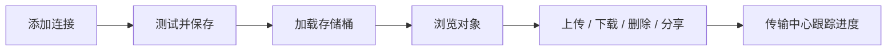
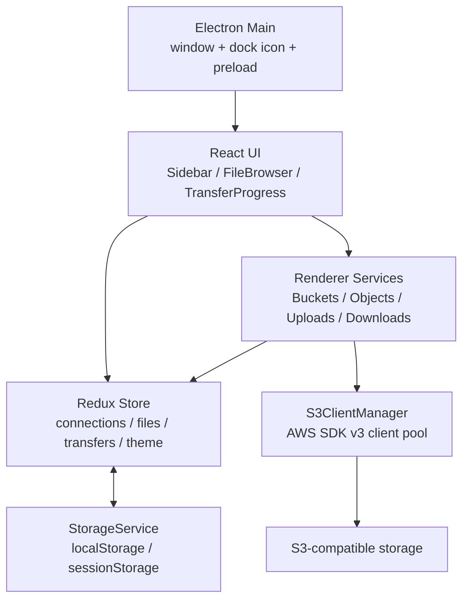

# S3 Client

<p align="center">
  
</p>

<p align="center">
  一个桌面端 S3 兼容对象存储客户端，用来管理连接、浏览存储桶、上传下载文件，并集中查看传输进度。
</p>

<p align="center">
  <strong>Electron</strong> · <strong>React</strong> · <strong>TypeScript</strong> · <strong>AWS SDK v3</strong>
</p>

## 功能特性

- 多连接管理：支持自定义连接名称、Endpoint、Access Key、Secret Key、可选 Region 和 Session Token。
- S3 兼容服务：适用于 AWS S3、MinIO、Cloudflare R2、阿里云 OSS、腾讯云 COS 等兼容 S3 API 的服务。
- 存储桶浏览：连接后加载 bucket 列表，并在侧边栏中快速切换。
- 文件管理：支持目录式浏览、创建文件夹、上传文件、上传文件夹、下载文件、删除文件/文件夹。
- 分享链接：为对象生成预签名下载链接。
- 传输中心：集中展示上传/下载任务、进度、速度、暂停、继续、取消和清理已完成任务。
- 本地持久化：连接配置、主题和可恢复传输任务会保存在本地。
- 跨平台打包：当前配置支持 macOS、Windows、Linux 构建。

## 界面与流程



## 架构概览



## 技术栈

- 桌面容器：Electron 40
- 前端：React 19、TypeScript、Vite
- 状态管理：Redux Toolkit、React Redux
- S3 操作：`@aws-sdk/client-s3`、`@aws-sdk/lib-storage`、`@aws-sdk/s3-request-presigner`
- 图标：lucide-react
- 打包：electron-builder

## 开发环境

要求：

- Node.js 20+
- npm
- macOS / Windows / Linux

安装依赖：

```bash
npm install
```

启动开发模式：

```bash
npm run dev
```

这会同时启动 Vite 开发服务器和 Electron。

## 打包

标准打包：

```bash
npm run build
```

按平台打包：

```bash
npm run build:mac
npm run build:win
npm run build:linux
```

当前 macOS 机器只打 Apple Silicon DMG，可使用：

```bash
npm exec vite -- build
node build.js
npx electron-builder --mac dmg --arm64 --config electron-builder.json \
  -c.electronDist=/Users/wangchuxiang/IdeaProjects/s3-client/node_modules/electron/dist \
  -c.mac.target=dmg
```

生成产物位于 `dist/`，例如：

```text
dist/S3 Client-0.0.0-mac-arm64.dmg
```

## 目录结构

```text
s3-client/
├── build/                  # 应用图标与打包资源
├── public/                 # Web 图标资源
├── src/
│   ├── main/               # Electron main / preload
│   ├── components/         # 主要 UI 组件
│   ├── renderer/
│   │   ├── services/       # S3 业务服务
│   │   └── store/          # Redux store 和 slices
│   └── shared/             # S3 client manager 和共享类型
├── build.js                # main process 编译脚本
├── build-all.js            # 多平台构建脚本
├── electron-builder.json   # electron-builder 配置
└── package.json
```

## 使用说明

1. 点击侧边栏“我的连接”右侧的 `+`。
2. 填写连接名称、Endpoint、Access Key ID 和 Secret Access Key。
3. 如需自定义 Region 或临时凭证，展开“高级选项”。
4. 点击“测试连接”，确认可访问后保存。
5. 选择连接和存储桶，进入文件浏览器。
6. 使用工具栏或文件列表操作上传、下载、删除、创建文件夹和生成分享链接。
7. 在传输中心查看任务进度，必要时暂停、继续、取消或清理完成任务。

## 注意事项

- Region 默认使用 `us-east-1`，多数 S3 兼容服务可以不手动填写。
- 连接凭证保存在本地存储中。不要在不受信任的设备上保存生产环境密钥。
- 上传任务的本地 `File` 对象无法跨应用重启持久化；失败后重试可能需要重新选择同一个文件。
- 下载任务使用分块 Range 请求保存进度，恢复时可能需要重新确认保存位置。
- macOS 未配置 Developer ID 签名和 notarization 时，首次运行可能需要在系统设置中允许打开。

## 常用脚本

| 命令 | 用途 |
| --- | --- |
| `npm run dev` | 启动开发模式 |
| `npm run build` | 构建前端、主进程并打包 |
| `npm run build:mac` | 构建 macOS 安装包 |
| `npm run build:win` | 构建 Windows 安装包 |
| `npm run build:linux` | 构建 Linux 安装包 |
| `npm run lint` | 运行 ESLint |

## 项目状态

这个项目仍在快速迭代中。当前重点是提升桌面端体验、传输中心稳定性、连接管理体验和跨平台打包质量。
